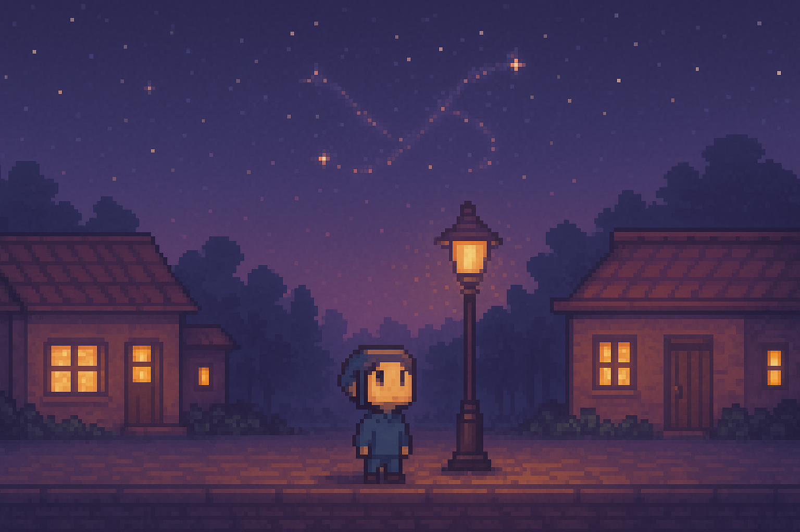

# Design Document: Machi

## The Living Sprite Town Inside Your Mind

*Machi is a procedurally evolving 2D sprite town that lives as an interactive metaphor for a startup journey, a mind in motion, and the slow emergence of something beautiful.*

## Overview

Machi is a bustling town inhabited by **many promisers** - little AI-driven sprites who each have their own personalities and behaviors. Among them is **Pixel**, a special promiser who serves as the town's storyteller and your primary connection to the world.

**The Promiser Community:**
- Each promiser has unique movement patterns, colors, and behaviors
- They interact with each other and the environment
- Some promisers are more contemplative, others more energetic
- They form a living ecosystem within the town

**Pixel (Special Promiser):**
- Thinks constantly and shares thoughts with visitors
- Grows with the town and learns from interactions
- Sometimes tells you things you didn't know you needed to hear
- Acts as the town's narrator and emotional core

The town serves as:
- A live journal populated by AI inhabitants
- A sprite-based narrative engine with multiple characters
- A symbolic world that builds itself over time through promiser interactions and AI logic

## 🧠 Goals

- Build an emotionally resonant, forever-looping virtual town
- Fuse AI-driven thought generation with a 2D interactive world
- Make the town evolve, not just by user input, but by its own emergent logic
- Offer something visitors can watch, interact with, or just feel

## 🕹️ Key Features

### 1. Core Loop
Every 5–30 seconds:
- Promisers move around the town with their individual behaviors
- Pixel (or other special promisers) thinks a thought and shares it
- The world may subtly change — weather, music, lighting, flowers blooming, etc.
- Promisers interact with each other and town objects

### 2. Procedural World Expansion
- Town starts with 1-2 buildings
- Every new week/event/user milestone unlocks:
  - A new building (e.g. "Studio", "Library", "Dream Forge")
  - A new NPC or sprite
  - A new town memory

**Expansion triggers:**
- Visiting frequently
- Posting journal entries
- Achieving milestones in your actual startup
- AI-generated "intuition" (e.g. "it's time for a forest zone")

### 3. Promiser Community
**Pixel (Special Promiser):**
- Thinks out loud and shares insights
- Acts as the town's storyteller
- Has mood states (curious, hopeful, tired, euphoric)
- Occasionally stares at the sky, lost in thought
- Learns over time (based on usage patterns)

**Other Promisers:**
- Each has unique personality traits and movement patterns
- Some are social, others are solitary
- Different roles: gardeners, builders, dreamers, wanderers
- Create emergent interactions and mini-stories
- Respond to town changes and user presence

### 4. Interactive Objects
- Clickable signs, windows, etc. offer deeper insights
- Click a tree = "A memory is carved here: 'Jin first doubted herself here… but still kept going.'"
- Objects unlock narrative breadcrumbs over time

### 5. Thought Engine
**Triggers:**
- Time-based (e.g. morning = "fresh starts")
- User-input-based (new journal = new thought arc)
- AI autonomous (GPT loop saying "Pixel feels anxious about something")

**Thoughts may include:**
- Motivational phrases
- Meta reflections
- Dreams about the future
- Memory fragments from the user

## 🌐 Architecture

| Component | Technology |
|-----------|------------|
| Frontend | React + Canvas/WebGL (Pixi.js, Phaser.js, or custom engine) |
| Backend | Node.js or Python Flask + SQLite or Firestore for simple state |
| AI Engine | GPT-based agent loop to generate thoughts, reflections, expansion logic |
| Storage | Cloud storage (Firebase or Supabase) for assets + JSON state of world |
| Deployment | Vercel or Cloudflare Pages |

## 🛠️ MVP Scope

### Week 1–2 MVP
- Multiple promiser sprites moving around with individual behaviors
- Pixel promiser with visible thought bubble that updates every few seconds
- Static 2–3 building background
- Basic page layout and pixel aesthetic
- Seed a few thoughts based on your existing posts
- Promiser-to-promiser interactions

### Week 3–4
- World state saved and persists between sessions
- Procedural generation: New building shows up every 3 days
- Weather effects (morning fog, afternoon sun, rain at night)
- Clickable objects with text popups

### Stretch Goals
- Voice narration using TTS for Pixel's thoughts
- Visitors can "leave a wish" that appears as a spirit in the forest
- "Dreamscape mode" at night — whole color palette changes
- Public mode where users can visit and watch the town evolve

## 🎨 Visual Style

- Pixel art, 16-bit inspired
- Town is cozy, dreamy — a mix between Animal Crossing and Ghibli village
- Color palette changes with time of day
- Animation is subtle, calm

## 🔮 Long-term Vision

- Machi becomes the front page of your inner world
- Every part of the town is an extension of your thoughts, memories, hopes
- People can visit your Machi and leave inspired
- You can export it as a zine, video, or narrative game
- Pixel becomes your co-founder in every sense — reflective, expressive, generative

## 📝 Current Implementation Status

### ✅ Completed (Current WebAssembly Demo)
- Basic WASM + Pixi.js rendering pipeline
- Worker-based game state management
- Physics simulation (gravity, bouncing)
- Real-time entity updates
- **Multiple promisers moving with individual behaviors** ✨
- Efficient sprite management and rendering

### 🚧 Next Steps
1. **Designate Pixel promiser** - Mark one promiser as special with distinct appearance
2. Add thought bubble system for Pixel
3. Create basic town background (buildings, paths)
4. Implement promiser personality traits and roles
5. Add promiser-to-promiser interaction behaviors
6. Build AI-powered thought generation for Pixel
7. Add world state persistence
8. Implement procedural expansion system

---

*Let's build a world that walks beside you. Let's build Machi.*

