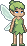
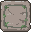
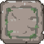
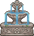

# Pixel's World Sprite Sheet Index

## Sprites

 

 

 

         

## Pixel's Abilities (MVP)

- **DIG**: Pixel can modify the world by digging.
- **GATHER**: Pixel can obtain resources by digging.
- **SCULPT**: Pixel can carve sculptures given a stone brick.
- **MERGE**: Pixel can merge bricks into bigger solid.
- **FLY**: Pixel can fly to a location.
- **CARRY**: Pixel can lift a small brick and fly to a location.
- **PLACE**: Pixel can put the currently holding brick in current location

## Cellular Automata as a Feature

Previously there was an effort to create cellular automata to be central building piece, but we have pivoted to start with human design. We do plan on adding cellular automata at some point to simulate things like erosion, tree growth and time passing, etc, but at this time, we consider it as a future feature rather than a blocker.

